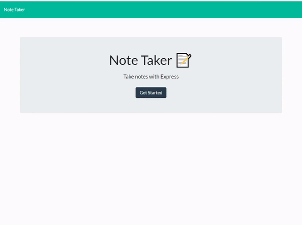
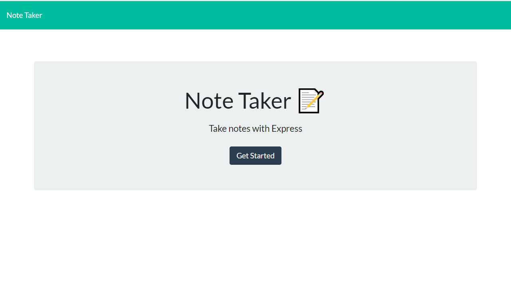

  # C11-Express-Note-Taker  
  

  ## Description  
  This Note Taker application uses Express.js to save and retrieve note data from a JSON file. Users are able to add and remove notes in any order.

  [Deployed App Link](https://c11-note-taker.herokuapp.com/)

  ## Table of Contents 
  * [description](#description)
  * [usage](#usage)
  * [questions](#questions)
  * [license](#license)
  
  ## Usage 
  User must visit the deployed application url and click "Get Started". User will then be taken to the database that houses all previously saved notes. If no notes are saved, user may begin by adding the first note. Users are then able to delete any of the saved notes in any order they choose. 
  
  

  

  ## Questions
  To check out more of my projects, visit my [GitHub](https://github.com/seifenan) page.
  To reach me with more questions email me at seifenan@gmail.com. 

  ## License
  
